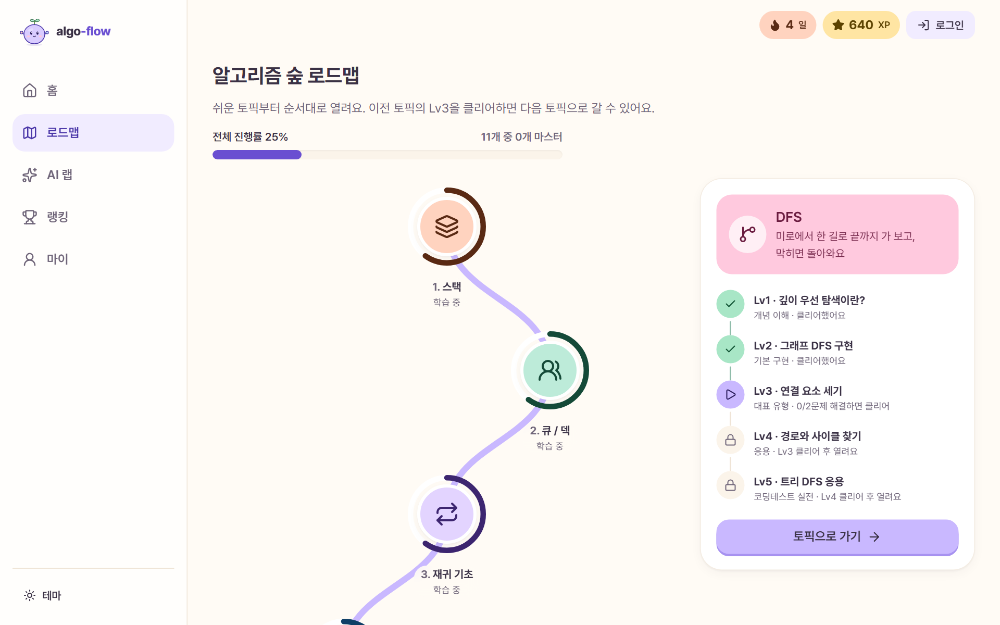
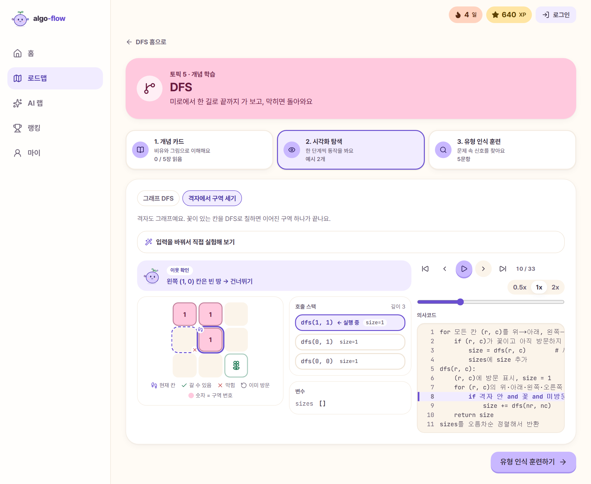
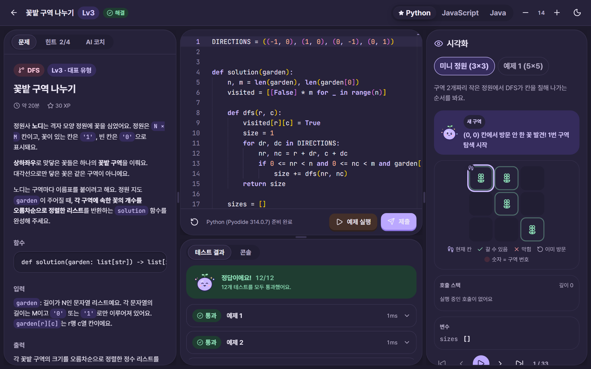

# algo-flow 🌱

**노디와 함께, 알고리즘을 쉬운 단계부터 차근차근.**

스택부터 DP까지, 개념을 그림과 애니메이션으로 이해하고 → "이 문제는 어떤 유형일까?"를 알아보는 연습을 하고 → 브라우저에서 바로 문제를 풀어요. 설치도, 가입도 필요 없어요.

👉 **[algo-flow 시작하기](https://algo-flow-pearl.vercel.app/)**



## 이런 걸 할 수 있어요

- **알고리즘 숲 로드맵**: 11개 토픽 × 5단계(개념 이해 → 구현 → 패턴 → 응용 → 실전), 165문제. 앞 토픽의 Lv3을 깨면 다음 토픽이 열려요.
- **개념 카드 + 시각화**: 비유와 그림으로 개념을 익히고, 알고리즘이 한 단계씩 움직이는 모습을 재생하며 봐요. 입력을 바꿔 직접 실험할 수도 있어요.
- **섞어 풀기**: 토픽 이름을 숨긴 문제를 여러 토픽에서 섞어 내요. 실제 시험처럼 문제만 보고 알고리즘을 먼저 골라 봐요.
- **유형 인식 훈련**: 문제 속 "신호"(예: _최소 몇 번_ → BFS, _모든 경우_ → 백트래킹)를 찾아 어떤 알고리즘을 떠올려야 하는지 연습해요.
- **브라우저에서 바로 채점**: Python · JavaScript · Java로 풀고 바로 채점해요. 틀리면 어느 테스트에서 왜 틀렸는지 알려 줘요.
- **4단계 힌트**: 유형 → 접근법 → 의사코드 → 핵심 코드(빈칸) 순서로, 필요한 만큼만 열어 봐요.
- **AI 코치 · AI 맞춤 문제**: 막히면 노디 코치에게 물어보고(정답은 알려 주지 않아요), 약한 유형은 AI가 새 문제를 만들어 줘요.
- **함께 자라는 노디**: 문제를 풀수록 노디가 자라고 꽃이 피어요. XP, 연속 학습, 배지, 주간 랭킹도 있어요.

로그인 없이 바로 시작할 수 있고, 로그인하면 기기 사이에 진도를 이어 가요.

## 화면 둘러보기

**개념 학습 · 시각화**: 격자에서 DFS가 칸을 칠해 나가는 과정을 한 단계씩 재생해요. 호출 스택과 의사코드의 지금 줄이 함께 움직여요.



**문제 풀이**: 문제 · 에디터 · 시각화를 한 화면에서 보며 풀고, 제출하면 바로 채점해요. (다크 모드)



## 커리큘럼

| #   | 토픽               | 한 줄 소개                                                    |
| --- | ------------------ | ------------------------------------------------------------- |
| 1   | 스택               | 접시 쌓기처럼, 마지막에 올린 것을 먼저 꺼내요                 |
| 2   | 큐 / 덱            | 줄 서기처럼, 먼저 온 사람이 먼저 나가요                       |
| 3   | 재귀 기초          | 마주 보는 거울처럼, 자기 자신을 다시 불러요                   |
| 4   | 그래프와 트리 표현 | 지하철 노선도처럼, 점과 선으로 관계를 그려요                  |
| 5   | DFS                | 미로에서 한 길로 끝까지 가 보고, 막히면 돌아와요              |
| 6   | BFS                | 물결처럼, 가까운 곳부터 한 겹씩 퍼져 나가요                   |
| 7   | 백트래킹           | 갈림길마다 하나씩 골라 보고, 아니면 되돌아와요                |
| 8   | 해시               | 이름표로 번호를 계산해서, 사물함 한 칸으로 바로 가요          |
| 9   | 정렬               | 기준을 정해 줄을 세우면, 보이지 않던 순서가 보여요            |
| 10  | 이분 탐색          | 가운데를 보고 절반씩 버리면, 100만 칸도 20번이면 찾아요       |
| 11  | DP                 | 한 번 푼 답은 표에 적어 두고, 작은 답을 모아 큰 답을 만들어요 |

모든 문제는 오리지널 이야기와 예제로 만들었고, 문제마다 세 언어의 모범 답안이 숨은 테스트(시간 초과를 잡는 큰 입력 포함)를 모두 통과하는지 자동으로 검증해요.

## 만든 기술

Next.js 16 · React 19 · TypeScript · Tailwind CSS · Motion · Monaco Editor · Pyodide(브라우저 Python) · CheerpJ(브라우저 Java) · Supabase · Claude API

## 직접 실행해 보기

```bash
pnpm install
pnpm dev   # http://localhost:3000
```

환경 변수 없이도 게스트 모드로 모든 학습 기능이 동작해요. 로그인·AI 기능 설정, 테스트, 배포, 운영 방법은 [개발 · 운영 가이드](docs/07-development.md)에, 설계 문서는 [docs](docs/README.md)에 있어요.
